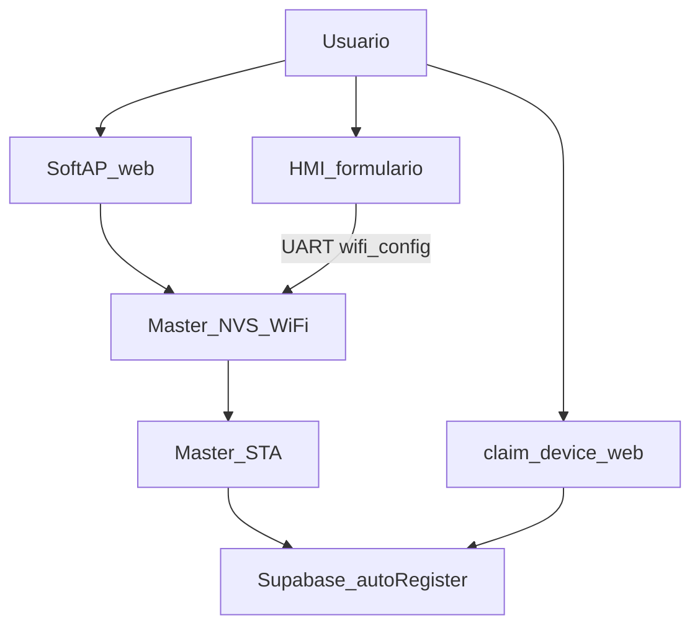

# Registro cloud — Master HIDROWAVE (dos vías)

**Principio:** el display **sirve al Master**. Supabase, SoftAP, `device_id` y claim viven en el Master. El HMI no lleva `SUPABASE_*` ni es cliente cloud.

## Dos vías (no se rompen entre sí)

| Vía | Quién | Qué hace |
|-----|--------|----------|
| **A SoftAP / web** | Siempre | SSID/pass (+ opcionales) → NVS Master → STA → auto-registro. Claim en web. |
| **B HMI UART** | Opcional | Mismos campos en el panel → `wifi_config` UART → **mismo** NVS/STA. SoftAP = fallback. |

Sin display: solo vía A. Nada raro. Last write wins si ambas configuran.

## Orden operador

### Solo Master (sin display / app web)

1. SoftAP (`ESP32-Hidro-Config` / doc Master) → SSID/pass.
2. SoftAP muestra **Device ID** (`ESP32_HIDRO_XXXXXX`).
3. STA → auto-registro / telemetría Supabase.
4. [`claim-device.html`](../ESP-HIDROWAVE/web/claim-device.html) → Auth → claim del mismo ID.

### Con display (vía B)

1. **Wizard** (pasos 4/5–5/5) o Setup → **WiFi**: red en 4/5, perfil en 5/5 → UART `wifi_config` + NVS HMI (NTP). SoftAP = vía A / fallback.
2. Master guarda el mismo NVS que SoftAP y conecta STA.
3. Claim web con Device ID (SoftAP, System HMI vía `sys_info`, o página SoftAP).
4. SoftAP sigue disponible si no hay HMI o UART caído.

### Wizard HMI

Idioma → reservorio → TZ → **WiFi (4/5)** → **Dispositivo (5/5)**. Claim Auth solo en web.

## SQL / web (Master)

| Pieza | Path |
|-------|------|
| Claim + legado email | [`ESP-HIDROWAVE/scripts/claim_device_auth.sql`](../ESP-HIDROWAVE/scripts/claim_device_auth.sql) |
| UI claim | [`ESP-HIDROWAVE/web/`](../ESP-HIDROWAVE/web/) |
| SoftAP | `ESP-HIDROWAVE/data/wifi-setup.html` |

Email SoftAP = **opcional / legado**. Ownership = `owner_id` vía `claim_device`.

## HMI

- Ajuste → **WiFi** = mismo layout que wizard 4/5 (solo red; UART + NTP). Perfil cloud = wizard 5/5.
- System: `device_id` / `cloud_ok` solo lectura (`sys_info`).
- No bloquear Central si no hay cloud.

## UART

Ver [`HMI_UART.md`](HMI_UART.md) (`wifi_config`, `sys_info`). Código Master: `MasterWifiProvision` + `HmiUartBridge`.

## Docs Master

[`ESP-HIDROWAVE/CONFIGURACAO_INICIAL_USUARIO.md`](../ESP-HIDROWAVE/CONFIGURACAO_INICIAL_USUARIO.md)
