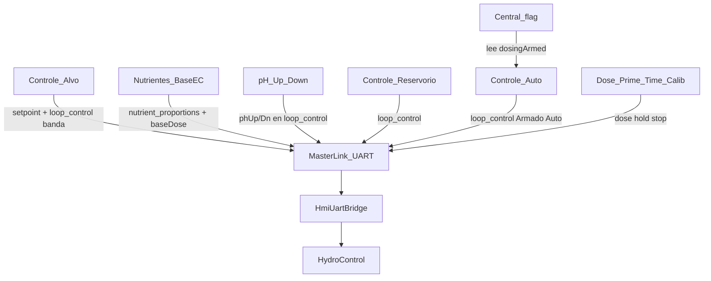

# Handoff — HIDRO HMI ↔ Master HIDROWAVE

**Fecha:** 2026-08-15  
**Validación en placa:** pendiente (cable / flasheo DoD).

Este archivo es el **mapa único** de lo que cruza HMI ↔ Master. JSON ejemplo: [`HMI_UART.md`](HMI_UART.md). Checklist extra Master prod: [`IMPLEMENTACAO_REAL_MASTERLINK_ESPHIDROWAVE.md`](IMPLEMENTACAO_REAL_MASTERLINK_ESPHIDROWAVE.md).

---

## Una frase

HMI configura y manda JSON por UART; **Master HIDROWAVE ejecuta** bombas, k (Base EC/L) y Auto. Landscape 480×320 listo; falta DoD físico.

---

## Verdad del sistema

| Rol | Path | Notas |
|-----|------|--------|
| Display | `ESP-SENSORS-main` | UI + `MasterLink.cpp` = TX contrato |
| Master | HIDROWAVE prod **o** zip `ESP-HIDROWAVE/` | Bridge: `HmiUartBridge.cpp` · lazo: `HydroControl` / `ECController` |

- Cable: HMI TX **17** ↔ Master RX **17**; HMI RX **18** ↔ Master TX **18**; GND; **115200**.
- Display: landscape **480×320** ([`DISPLAY_BASELINE.md`](DISPLAY_BASELINE.md)).
- Central EC/pH/ORP/DO: `lv_font_montserrat_num_60` (**sin** `transform_zoom`).
- **Deadband Auto:** siempre half-band Alvo (`ecLo`/`ecHi`, `phLo`/`phHi` si `hi > lo`). Diseño: **nunca** `50` µS fijo. Zip: `controlDeadbandUs()` aún usa 50 si Consumo 24h OFF — gap Master.

---

## Quién calcula qué

| Dato | Quién | Dónde |
|------|--------|--------|
| Receta ml/L + proporciones | Usuario HMI | Dosificación → Nutrientes |
| **Base EC/L** (`recipeEcUs` = `baseDose`) | Usuario HMI (2/2) | EC de etiqueta para **1 L** de receta |
| Alvo + banda muerta | Usuario HMI | Controle → Alvo → UART `setpoint` + `ecLo`/`ecHi` |
| Volumen, Lote/Recirc, gaps | Usuario HMI | Controle → Reservorio → `loop_control` |
| Armado / Auto EC/pH | Usuario HMI | Controle → Auto → `loop_control` |
| **k = baseDose / totalMlPerLiter** | **Master** | `applyRecipeGain` → `ECController` |
| **u(t)** dosis Auto + split proporcional | **Master** | `checkAutoEC` → bombas R1…R6 |
| Atlas ESP-NOW | Master | HMI solo UART `relay_slave` / `slaves_req` |

HMI **no** envía k. Envía receta + Base EC/L; Master arma el ganho.

### Auto pH — no hay cálculo en el Master

Existe `ECController` (error EC → k → ml de receta → `checkAutoEC`).  
**No existe** un controlador equivalente de pH (error pH → ml Up/Down).

La HMI manda `autoPh`, `phLo`/`phHi`, `phUpRelay`/`phDownRelay`. El bridge **solo guarda NVS** (`hmi_auto_ph`, `hmi_ph_up`…). **Nadie** en el loop lee pH, calcula dosis ni acciona esas bombas.

- Auto pH ON en pantalla **no mueve bombas**.
- Dose **manual** pH Up/Down sí puede (action `dose` al canal).
- Falta el **lazo automático**, no el botón.

Caudal de **dreno** (dilución Recirc) es otro sensor/uso; no es Base EC/L ni el `flowRate` interno de `ECController`.

---

## Contrato UART (todo lo que cruza el cable)

Líneas JSON + `\n`. Tras cmds de proceso: `{"t":"cmd_ack","action":"...","ok":true,"commandId":N}`.

### Display → Master

| Action | Cuándo HMI | Master debe |
|--------|------------|-------------|
| `dose` / `dose_hold` / `dose_stop` | Manual Dose/Prime/Time | Dosar / hold / parar `R1`…`R6` |
| `nutrient_proportions` | Guardar receta o Base EC/L | `updateNutrientProportions` + **`applyRecipeGain`** |
| `setpoint` | Guardar Alvo | EC → lazo; pH → runtime o NVS |
| `loop_control` | Auto / Reservorio / Guardar Alvo EC\|pH / pH relays | Volumen, armed, Auto, bandas, consumo 24h, mode |
| `calib` | (UI bloqueada) | Ack stub |
| `wifi_config` | WiFi Master | SoftAP + ack |
| `sys_info_req` | System | `t:sys_info` |
| `slaves_req` | Atlas Actualizar | `t:slaves` |
| `relay_slave` | Atlas ON/OFF/Ciclo/Timer | ESP-NOW; **rechazar** MAC `atlas`/`local` |
| `relay_local` | Relé Master local | `setRelay` |

### Master → Display

| `t` | Uso |
|-----|-----|
| `telemetry` | ph, ec, temp_agua; orp/do opc. |
| `cmd_ack` | Tras cada cmd de proceso |
| `slaves` | Inventario local + Atlas |
| `sys_info` | device_id / cloud |

### `nutrient_proportions` (Base EC/L)

```json
{"t":"cmd","action":"nutrient_proportions","totalMlPerLiter":12.0,"recipeEcUs":1525,"baseDose":1525,"nutrients":[
  {"name":"Grow","relayNumber":1,"mlPerLiter":5.0,"proportion":0.4167,"active":true}
]}
```

- `recipeEcUs` = `baseDose` = EC etiqueta @ 1 L (µS). `0` = no definida → **no pisar** k.
- Master zip: `HmiUartBridge::handleNutrientProportions` → `setBaseDose` + `setTotalMl` → `k = baseDose / totalMl`.
- Código: `HydroControl::applyRecipeGain`.

### `loop_control` (núcleo)

Campos HMI: `volumeL`, `homoSec`, `nutrientGapSec`, `pulseMl`, `pulseGapSec`, `dosingDelaySec`, `dosingMode` (`batch`\|`recirc`), `dosingArmed`, `autoEc`/`autoPh` + intervalos, `maxStepEc`/`Ph` (0…1), `dosingConst*` **siempre 0**, `phUpRelay`/`phDownRelay`, `consumoDiario`, `consumoPh24h`, `ecLo`/`ecHi`, `phLo`/`phHi`.

Sin `dosingArmed`, HMI manda Auto en false.

---

## Estado UI (resumen)

- **Central:** `temp°C` · flag `INACTIVO|ACTIVO` (= `dosingArmed`, solo lectura) · `HH:MM` · `≡`.
- **Controle → Auto:** Cadeado (`autoUiLocked`, **no UART**) · Armado (overlay al ACTIVO) · Auto EC/pH · Consumo 24h · agresividad.
- **Dosificación → Nutrientes:** receta ml/L + fila **Base EC/L** + paso **2/2** si falta força.
- **Reservorio:** Lote \| Recirc (hints: Lote/Recirc ES-PT; Batch/Recirc EN).
- SETTINGS: Controle (Alvo · Auto · Reservorio) · Atlas · Dosificación · Ajuste · System · Sensors.
- **Calib sensor:** cortina HMI; calib en **módulo físico**. No afecta PumpCalib.
- **Atlas offline:** toast *Atlas offline. Conecte Atlas y pulse Actualizar.* (ES/EN/PT). Cortina hasta MAC real online.

---

## Trilha operador → dosis



| Paso | Dónde | UART |
|------|--------|------|
| 1 | Controle → Alvo | `setpoint` + `ecLo/Hi` `phLo/Hi` |
| 2 | Nutrientes | `nutrient_proportions` (ml/L + **Base EC/L**) |
| 3 | pH Up / Down | `phUpRelay` / `phDownRelay` |
| 4 | Reservorio | `volumeL` / homo / gaps / `dosingMode` |
| 5 | Auto Armado → ACTIVO | `dosingArmed` |
| 6 | Auto EC/pH ON | `autoEc` / `autoPh` + Consumo 24h opc. |
| 7 | Central | Flag ACTIVO + `telemetry` LIVE |

Manual Dose/Prime/Time/Calib: solo Armado **INACTIVO**.

---

## Matriz HMI ↔ Master

**OK** = punta a punta · **PARCIAL** = HMI envía / Master incompleto · **HUECO** = ausente · **N/A** = no cruza UART.

| Función | MasterLink | Action | Master | Estado |
|---------|------------|--------|--------|--------|
| Telemetría Central | RX | `telemetry` | TX | OK (`orp`/`do` opc.) |
| Link / proceso | `linkOk` | `cmd_ack` | `emitAck` | OK |
| Dose ml / hold / stop | `sendDose*` | `dose` / `hold` / `stop` | `handleDose` | OK |
| Receta ml/L | `sendNutrientProportions` | `nutrient_proportions` | `updateNutrientProportions` | OK |
| **Base EC/L → k** | idem `recipeEcUs`/`baseDose` | idem | **`applyRecipeGain`** | **OK (zip 2026-08-15)** |
| Armado + Auto EC | `sendLoopControl` | `loop_control` | `setAutoECEnabled(armed && autoEc)` | OK |
| Banda Alvo EC | idem | `ecLo`/`ecHi` | `setEcDeadbandLimits` | HMI OK; zip 50 si Consumo OFF |
| Banda Alvo pH | idem | `phLo`/`phHi` | `setPhDeadbandLimits` | HMI OK; Master sync |
| Consumo EC/pH 24h | idem | `consumoDiario` / `consumoPh24h` | setters | HMI OK; Master sync |
| Agresividad EC | idem | `maxStepEc` | `setMaxStepEcFraction` | OK |
| Volumen | idem | `volumeL` | `setVolume` | OK |
| Auto pH + maxStepPh | idem | `autoPh` | NVS `hmi_auto_ph` — **sin PHController / sin tick** | PARCIAL |
| pH Up/Down relays | idem | `phUp`/`phDown` | NVS only | PARCIAL |
| Homo / gaps / pulsos / mode / delay | idem | varios | ignorados en handler | PARCIAL |
| Setpoint EC | `sendSetpoint("ec")` | `setpoint` | `setECSetpoint` | OK |
| Setpoint pH | `sendSetpoint("ph")` | `setpoint` | NVS | PARCIAL |
| Setpoint ORP/DO | si UI envía | — | no | HUECO |
| Calib sensor | `sendCalib` | `calib` | ack stub; UI cortina | PARCIAL |
| WiFi Master | `sendWifiConfig` | `wifi_config` | SoftAP + ack | OK |
| Sys info | `requestSysInfo` | `sys_info` | OK | OK |
| Inventario Atlas | `requestSlaves` | `slaves_req` | `t:slaves` | OK |
| Relé Atlas | `sendRelaySlave` | `relay_slave` | OK si MAC real | OK* |
| Relé local | `sendRelayLocal` | `relay_local` | `setRelay` | OK |
| Cadeado UI | — | — | — | N/A |
| Rules SI→ENTONCES | — | web | — | HUECO HMI |
| Cloud / claim | — | Master SoftAP | — | N/A HMI |

\* MAC `"atlas"` / `"local"` → reject. Hub: cortina hasta inventario online.

---

## Cómo ejecutar (DoD físico)

1. Cable 17/18 cruzados + GND; 115200.
2. HMI: `DATA_SOURCE_SIM=0`; `pio run -e esp32-s3-hmi -t upload`.
3. Master: flash HIDROWAVE (puerto distinto) **con** `applyRecipeGain`.
4. Serial HMI: `[UART TX]` dose / `loop_control` / `nutrient_proportions`; Central LIVE.
5. Checklist:
   - System: link OK + **Proceso UART** (`cmd_ack`).
   - Armado INACTIVO → Dose R1 → bomba / ack.
   - Armado ACTIVO → Manual bloqueado.
   - Receta + Base EC/L → TX `baseDose`/`recipeEcUs`; Serial Master `Recipe gain`.
   - Auto EC ON → Master usa k + bandas Alvo (no 50).
   - UART off >5 s → link KO.

---

## Gaps

1. DoD en placa (humano).
2. Master: **Auto pH runtime** (hoy no hay cálculo; solo NVS) + homo/gaps/pulsos/mode/delay.
3. Deadband: quitar 50 fijo; siempre half-band Alvo.
4. Calib sensor UART; reactivar `CalibScreen` cuando Master esté listo.
5. Consumo EC/pH 24 h en Master **prod**.
6. ORP/DO setpoint / telemetría si el producto lo pide.
7. Rules web; HMI no hace ESP-NOW directo.

---

## Cloud / Atlas

- Registro Supabase = **Master** (SoftAP + `claim_device`). HMI no es cliente cloud — [`CLOUD_REGISTER.md`](CLOUD_REGISTER.md).
- Atlas: relé1…8 → Nombre \| Accionamiento. Sin MAC real, sin UART de relé.

---

## Docs anexos (detalle, no el mapa)

| Doc | Uso |
|-----|-----|
| [`HMI_UART.md`](HMI_UART.md) | Ejemplos JSON |
| [`IMPLEMENTACAO_REAL_MASTERLINK_ESPHIDROWAVE.md`](IMPLEMENTACAO_REAL_MASTERLINK_ESPHIDROWAVE.md) | Checklist porta Master prod |
| [`HMI_OPERATOR_GUIDE.md`](HMI_OPERATOR_GUIDE.md) | Orden operador |
| [`HMI_NAV_MAP.md`](HMI_NAV_MAP.md) | Árbol pantallas |
| [`HMI_DESIGN.md`](HMI_DESIGN.md) · [`DISPLAY_BASELINE.md`](DISPLAY_BASELINE.md) | UI |
| [`HMI_RULES.md`](HMI_RULES.md) | Rules fuera del HMI |
| [`CLOUD_REGISTER.md`](CLOUD_REGISTER.md) | Claim / SoftAP |

---

## Prompt al retomar

> Continúa desde `docs/HANDOFF.md` (2026-08-15) — **mapa único HMI↔Master**. Base EC → `applyRecipeGain`. Auto pH: **sin cálculo en Master** (solo NVS). Deadband Alvo (gap zip: 50 si Consumo OFF). PARCIAL: autoPh / gaps / calib. Prioridad: DoD cable. No zoom en Central.
