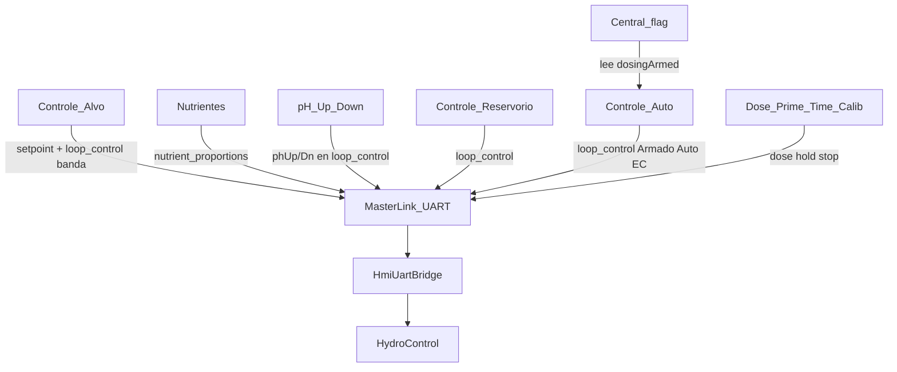

# Handoff — HIDRO HMI ↔ Master HIDROWAVE

**Fecha:** 2026-08-10 (reevaluación + matriz Master)  
**Validación en placa:** pendiente (cable / flasheo DoD).

---

## Una frase

HMI configura y manda JSON por UART; **Master HIDROWAVE ejecuta** bombas y Auto. Landscape 480×320 listo; falta DoD físico. **Todo lo que el Master debe implementar para interoperabilidad:** [`IMPLEMENTACAO_REAL_MASTERLINK_ESPHIDROWAVE.md`](IMPLEMENTACAO_REAL_MASTERLINK_ESPHIDROWAVE.md) (**canónico**).

---

## Verdad del sistema

| Rol | Path | Notas |
|-----|------|--------|
| Display (este) | `ESP-SENSORS-main` | UI + `MasterLink` = contrato TX |
| Master (verdad) | HIDROWAVE de **producción** | Seguir **solo** [`IMPLEMENTACAO_REAL_MASTERLINK_ESPHIDROWAVE.md`](IMPLEMENTACAO_REAL_MASTERLINK_ESPHIDROWAVE.md) (canónico Master←Display) |
| Bridge auditado en zip | `ESP-HIDROWAVE/src/HmiUartBridge.cpp` | Puede diferir del Master de prod; sync con doc IMPLEMENTACAO_REAL |

- Contrato HMI: [`src/uart/MasterLink.cpp`](../src/uart/MasterLink.cpp) · [`docs/HMI_UART.md`](HMI_UART.md).
- Display: landscape **480×320** ([`DISPLAY_BASELINE.md`](DISPLAY_BASELINE.md)).
- Central valores EC/pH/ORP/DO: `lv_font_montserrat_num_60` (**sin** `transform_zoom`).
- **Deadband Auto EC/pH:** siempre banda Alvo (`ecLo`/`ecHi`, `phLo`/`phHi` si `hi > lo`). No usar `50` µS fijo como diseño.

---

## Estado UI (resumen)

- **Central:** `temp°C` · flag `INACTIVO|ACTIVO` (solo lectura = `dosingArmed`) · `HH:MM` · `≡`.
- **Controle → Auto:** **Cadeado** (`autoUiLocked`, solo UI, **no UART**) · **Armado** (`dosingArmed`, confirm overlay al pasar a ACTIVO) · Auto EC/pH · Consumo EC 24h · Consumo pH 24h · agresividad.
- **Cadeado cerrado:** cortina sobre config; Armado/Cadeado siguen tocables.
- **Consumo EC 24h** (`consumoDiario`) / **Consumo pH 24h** (`consumoPh24h`): capas paralelas e independientes; no cambian intervalos Auto.
- SETTINGS: Controle (Alvo · Auto · Reservorio) · Atlas · Dosificación · Ajuste · System · Sensors.
- **Sensors → Calibrar** (pH/EC/ORP/DO): UI con **cortina temporal** (`kSensorCalibUiBlocked` en `CalibScreen`). Calibrar en el **módulo físico** (botones). Atrás libre; lista sigue navegable. **No** afecta PumpCalib (caudal bomba).

---

## Trilha operador → dosis (HMI + Master juntos)

| Paso | Dónde | Para qué |
|------|--------|----------|
| 1 | Controle → Alvo | Setpoint + banda EC/pH (`ecLo/Hi`, `phLo/Hi`) |
| 2 | Dosificación → Nutrientes | Receta ml/L → bombas R1…R6 |
| 3 | pH Up / pH Down | Asignar bombas (vía `loop_control`) |
| 4 | Controle → Reservorio | Volumen / homo / gaps / mode |
| 5 | Auto: Armado → confirmar → ACTIVO | Autoriza malla |
| 6 | Auto EC/pH ON (+ Consumo EC/pH 24h opc.) | Lazos en Master |
| 7 | Central | Flag ACTIVO + telemetría LIVE |

Manual Dose/Prime/Time/Calib: solo con Armado **INACTIVO** (`manualDoseAllowed`).

---

## Matriz de funciones compartidas HMI ↔ Master

**OK** = punta a punta usable · **PARCIAL** = HMI envía / Master ack o NVS sin efecto pleno · **HUECO** = stub o ausente · **N/A** = solo HMI / solo Master.

| Función HMI | API `MasterLink` | Action / RX | Master bridge | Estado |
|-------------|------------------|-------------|---------------|--------|
| Telemetría Central | RX | `telemetry` | Master TX | OK (`orp`/`do` opcionales) |
| Link / proceso UART | `linkOk` / `processBridgeOk` | `cmd_ack` | `emitAck` | OK |
| Dose ml | `sendDose` | `dose` | `handleDose` | OK |
| Dose hold/stop | `sendDoseHold` / `Stop` | `dose_hold` / `dose_stop` | `handleDose` | OK |
| Nutrientes | `sendNutrientProportions` | `nutrient_proportions` | `updateNutrientProportions` | OK |
| Armado + Auto EC | `sendLoopControl` | `loop_control` | `setAutoECEnabled(armed && autoEc)` | OK |
| Banda Alvo EC | idem | `ecLo` / `ecHi` | `setEcDeadbandLimits` | OK (si `hi > lo`) |
| Banda Alvo pH | idem | `phLo` / `phHi` | `setPhDeadbandLimits` | HMI OK; Master sync |
| Consumo EC 24h | idem | `consumoDiario` | `setConsumoDiarioEnabled` | HMI OK; Master sync |
| Consumo pH 24h | idem | `consumoPh24h` | `setConsumoPh24hEnabled` | HMI OK; Master sync |
| Agresividad EC | idem | `maxStepEc` | `setMaxStepEcFraction` | OK |
| Volumen | idem | `volumeL` | `setVolume` | OK |
| Auto pH + agresividad pH | idem | `autoPh` / `maxStepPh` | solo NVS `hmi_auto_ph` | PARCIAL |
| pH Up/Down relays | idem | `phUpRelay` / `phDownRelay` | NVS only | PARCIAL |
| Homo / gaps / pulsos / mode / delay | idem | varios | ignorados en handler | PARCIAL |
| Setpoint EC | `sendSetpoint("ec")` | `setpoint` | `setECSetpoint` | OK |
| Setpoint pH | `sendSetpoint("ph")` | `setpoint` | NVS `hmi_ph_sp` | PARCIAL |
| Setpoint ORP/DO | si UI envía | — | no | HUECO |
| Calib sensor | `sendCalib` | `calib` | ack stub; **UI HMI bloqueada** (cortina; calib = módulo fisico) | PARCIAL |
| WiFi Master | `sendWifiConfig` | `wifi_config` | SoftAP path + ack | OK |
| Sys info / device id | `requestSysInfo` | `sys_info` | OK | OK |
| Inventario slaves | `requestSlaves` | `slaves_req` / `slaves` | OK | OK |
| Relé Atlas ESP-NOW | `sendRelaySlave` | `relay_slave` | OK si MAC real | OK* |
| Relé local Master | `sendRelayLocal` | `relay_local` | `setRelay` | OK |
| Cadeado UI | — | — | — | N/A |
| Rules SI→ENTONCES | — | web | — | HUECO en HMI |
| Cloud / claim | — | Master SoftAP | — | N/A HMI |

\* MAC `"atlas"` / `"local"` → bridge rechaza `relay_slave` (diseño). Hub Atlas: cortina hasta inventario online; Actualizar = `slaves_req`.

---

## Cómo ejecutar (DoD físico)

1. **Cable:** HMI TX **17** ↔ Master RX **17**; HMI RX **18** ↔ Master TX **18**; GND común. Baud **115200**.
2. **HMI:** `platformio.ini` → `DATA_SOURCE_SIM=0`; `pio run -e esp32-s3-hmi -t upload` (COM del display).
3. **Master:** flash HIDROWAVE (puerto distinto; prod ≥ contrato IMPLEMENTACAO_REAL).
4. **Serial HMI:** `[UART TX]` en dose / `loop_control`; Central con LIVE (no solo `--` por SIM).
5. **Checklist:**
   - System: link OK + **Proceso UART** tras un cmd (`cmd_ack`).
   - Armado INACTIVO → Dose R1 → bomba / ack.
   - Armado ACTIVO → Manual bloqueado (`DoseBlockedArmed`).
   - Nutrientes + Armado + Auto EC/pH ON → `loop_control`; Master usa bandas Alvo + flags Consumo 24h.
   - UART off >5 s → link KO.

---

## Gaps (prioridad siguiente código)

1. Validar DoD en placa (humano).
2. Master: aplicar resto de `loop_control` (homo/gaps/pulsos/mode/delay) + **Auto pH runtime** (hoy NVS), o declarar fuera de alcance v1.
3. Calib sensor: hoy cortina HMI + módulo fisico; reactivar `CalibScreen` (`kSensorCalibUiBlocked=false`) cuando calib UART esté lista en Master.
4. Master prod: capas Consumo EC/pH 24 h según [`IMPLEMENTACAO_REAL_MASTERLINK_ESPHIDROWAVE.md`](IMPLEMENTACAO_REAL_MASTERLINK_ESPHIDROWAVE.md).
5. ORP/DO setpoint / telemetría completa si el producto lo exige.
6. Rules web; HMI no hace ESP-NOW directo (todo vía Master).

---

## Cloud / Atlas (recordatorio)

- Registro Supabase = **Master** (SoftAP + `claim_device`). HMI no es cliente cloud — [`CLOUD_REGISTER.md`](CLOUD_REGISTER.md).
- Atlas: SETTINGS → relé1…8 → Nombre \| Accionamiento (ON/OFF · Ciclo · Timer). Sin MAC real, sin UART de relé.
- **Hub Atlas:** cortina dinámica si MAC placeholder `"atlas"` o slave ESP-NOW offline. **Atrás** y **Actualizar** (`slaves_req`) fuera del velo; al llegar inventario online se oculta.

---

## Docs cruzados

| Doc | Uso |
|-----|-----|
| [`IMPLEMENTACAO_REAL_MASTERLINK_ESPHIDROWAVE.md`](IMPLEMENTACAO_REAL_MASTERLINK_ESPHIDROWAVE.md) | **Canónico Master←Display** (actions UART, bandas, Consumo 24h, checklist, gaps) |
| [`HMI_UART.md`](HMI_UART.md) | Anexo contrato JSON (deadband = Alvo; `consumoDiario` / `consumoPh24h`) |
| [`HMI_OPERATOR_GUIDE.md`](HMI_OPERATOR_GUIDE.md) | Orden operador |
| [`HMI_NAV_MAP.md`](HMI_NAV_MAP.md) | Árbol pantallas |
| [`HMI_DESIGN.md`](HMI_DESIGN.md) · [`DISPLAY_BASELINE.md`](DISPLAY_BASELINE.md) | UI / display |
| [`HMI_RULES.md`](HMI_RULES.md) | Rules fuera del HMI |
| [`CLOUD_REGISTER.md`](CLOUD_REGISTER.md) | Claim / SoftAP |

Este `HANDOFF.md` = mapa HMI + DoD + matriz de estado. **No** duplicar reglas de lazo Master aquí.

---

## Prompt al retomar

> Continúa desde `docs/HANDOFF.md` (2026-08-10). Master prod: checklist canónico `IMPLEMENTACAO_REAL_MASTERLINK_ESPHIDROWAVE.md` (actions UART + banda Alvo + Consumo EC/pH 24h). Matriz: OK dose/nutrients/Auto EC; PARCIAL autoPh/gaps/calib. Prioridad: DoD cable + sync Master canónico. No zoom en Central.
