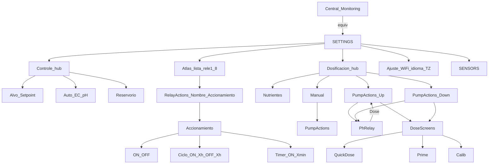

# Mapa de navegación — HIDRO HMI

Según `ScreenId` en `include/NavShell.h`.  
**Viewport:** landscape lógico **480×320** — [`DISPLAY_BASELINE.md`](DISPLAY_BASELINE.md).

## Resumen

| Qué | Detalle |
|-----|---------|
| SETTINGS (6) | **Controle** · **Atlas** · **Dosificación** · Ajuste · System · Sensors |
| Controle | **Alvo** (Setpoint) \| Auto EC/pH \| Reservorio |
| Atlas | **relé1…8** → Nombre \| Accionamiento → ON/OFF · Ciclo · Timer |
| Dosificación | Nutrientes \| Manual \| **pH Up** \| **pH Down** |
| Tap Central EC/pH | `DosingInfo` |

Entrada: **≡** → SETTINGS. Salida: **Atras**.

**Wizard** (`!setup_done`): Welcome → Language → Reservoir → TimeZone → **MasterWifi (4/5)** → **MasterWifiProfile (5/5)** → Ready → Central.

**Atlas Accionamiento:** ON/OFF · Ciclo (h, 24h) · Timer (min ON+OFF digital). Timer bloquea Ciclo en el mismo relé hasta Stop.

**Roles:** Nutrientes/Manual/pH = Master. **Atlas** = relés ESP-NOW. Controle = Alvo + Auto + tanque. Rules SI→ENTONCES = **web**.

---

## Árbol

### Manual → bomba (esquema Nuravine)

`goToDose` abre **PumpActions** (no Quick Dose directo).

| Fila | ScreenId |
|------|----------|
| Nombre | `PumpName` |
| Prime | `PumpPrime` |
| Calibrar | `PumpCalib` (60 s) |
| Quick Dose | `DosingChannel` |
| Time Dose | `PumpTimeDose` |
| Quantity | `PumpQuantity` |

**pH Up / pH Down** = mismo hub que manual (`PumpActions`: fila Relé + Nome·Prime·Calib·Quick·Time·Quantity). Sin bomba asignada → `PhRelay` primero (lista `makeMenuRow`; tap = draft; **Guardar** = NVS + hub `PumpActions`; Atras descarta).

**Backlight** (Ajuste): Siempre ON \| Auto 60 s \| Apagado. Auto-off solo sin alarma de proceso (pH·EC·ORP·DO BAJO/ALTO). Toque con BL off = solo wake. Alarma fuerza ON.

**System:** UART link + flag **Proceso UART** (`cmd_ack` / `process_bridge`). SoftAP Master: SSID `ESP32_Hidropônico` clave `hidrosetup`.

### SETTINGS (orden)

1. Controle → Alvo · Auto · Reservorio  
2. Atlas → relé1…8 → Nombre \| Accionamiento → ON/OFF · Ciclo · Timer  
3. Dosificación → Nutrientes \| Manual \| pH Up \| pH Down  
4. Ajuste → WiFi · Idioma · TZ · Retroiluminacion · Reset *(sin Reservorio)*  
5. System  
6. Sensors → Calibrate · Display · Units *(sin Alvo)*

---

## Módulos

| Módulo | Rol |
|--------|-----|
| `Controle` / `ControleAuto` | Hub + mando Auto |
| `Niveles` (UI **Alvo**) | Setpoint + banda muerta |
| `RelayActions` / `RelayActuation` | Hub por relé Atlas |
| `RelayName` / `RelayOnOff` | Alias + ON\|OFF; placeholder si no hay ESP-NOW |
| `Reservoir` | Malha física (vía Controle / wizard) |
| Rules | Sin menú / sin tick — [`HMI_RULES.md`](HMI_RULES.md) |
