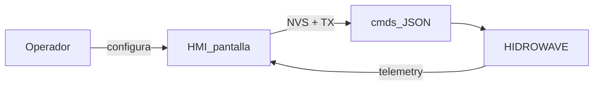

# Guía de operador — HIDRO HMI

**Público:** quien configura y vigila el cultivo desde la pantalla.  
**Placa:** JC3248W535 · landscape **480×320**.  
**Árbol:** [`HMI_NAV_MAP.md`](HMI_NAV_MAP.md) · **Controle/Atlas:** [`HMI_RULES.md`](HMI_RULES.md) · **UART:** [`HMI_UART.md`](HMI_UART.md)

---

## 1. Rol del HMI

El display **configura parámetros y envía comandos**. El **lazo Auto EC / Auto pH y las bombas se ejecutan en el master** (HIDROWAVE).

- **Central:** telemetría en vivo (pH, EC, temp, ORP…). Header: `temp°C · INACTIVO|ACTIVO · HH:MM · ≡` (i18n; sin título).
- `--` en una celda = lectura **ocultada** en Sensors → Display Readings (no es fallo de sensor).

---

## 2. Puesta en marcha (orden recomendado)

| Paso | Dónde | Para qué |
|------|--------|----------|
| 1 | Wizard: Idioma → **Reservorio** → TZ → WiFi (4/5) → Dispositivo (5/5) | Base física y red antes del Auto |
| 2 | Controle → Alvo / Auto / Reservorio | Setpoint + banda muerta + malha |
| 3 | Dosificación → Nutrientes | ml/L + bomba Master bomba1–6 (receta) |
| 3b | Dosificación → pH Up / pH Down | Hub + asignación (UI bomba1–6); acciones sobre el canal |
| 4 | Dosificación → Manual | Calib caudal / dose de prueba |
| 5 | Atlas → reléN → Nombre / Accionamiento | Accionamiento: ON/OFF · Ciclo · Timer |
| 6 | Controle → Auto: **Armado** INACTIVO → confirmar → ACTIVO | Autoriza malha (flag en Central) |
| 7 | Controle → Auto: **Cadeado** Abierto, luego Auto EC/pH **ON** | Cadeado Cerrado = cortina de edición |

Entrada: **≡** → SETTINGS. Salida: **Atras**.

---

## 3. Malha fechada — controles

**Controle → Reservorio:** volumen · homo · delay · Batch\|Recirc · gaps.  
**Controle → Auto:** **Cadeado** (`Cerrado` \| `Abierto`) = solo trava UI de config. **Armado** (`INACTIVO` \| `ACTIVO`) = autoriza malla al Master (`dosingArmed`). Pasar a ACTIVO pide confirmación a pantalla completa; volver a INACTIVO es inmediato. Central muestra Armado como **flag** (sin tap). Con Cadeado **Abierto**, Cadeado/Armado scroll con el resto. Con Cadeado **Cerrado**, filas sticky bajo header + cortina: intervalos / Auto EC·pH / Consumo EC·pH 24h / agresividad / Guardar inaccesibles; Armado sigue tocable.

**Consumo EC 24h** (bajo Auto EC) y **Consumo pH 24h** (bajo Auto pH): capas avanzadas **independientes**. Deadband = banda Alvo (EC o pH). Con ON, el Master registra valor al inicio de ventana y a las 24 h valida el Δ (EC: hambre/dilución; pH: Up/Down). No cambian `autoEcInterval` / `autoPhInterval`. El tick Auto sigue durante la ventana.  
NVS + UART `loop_control`.

| Control | Default | Significado |
|---------|---------|-------------|
| Volumen (L) | 50 | Agua asumida para dosis |
| Homogenización (s) | 60 | Espera tras inyectar |
| Delay dose (s) | 60 | Espera / 2ª lectura |
| Batch \| Recirc | Batch | Recirc añade gaps / pulsos |
| Gap nutrientes (s) | 3 | Pausa entre bombas |
| ml por pulso | 2.0 | Inyección partida |
| Gap pulsos (s) | 2 | Pausa entre pulsos |
| Intervalo Auto EC/pH (s) | 30 | Periodo de evaluación master |
| Auto EC / Auto pH | OFF | Solo editable si LIBERADO |
| Consumo EC 24h | OFF | Capa sobre Auto EC; UART `consumoDiario` |
| Consumo pH 24h | OFF | Capa sobre Auto pH; UART `consumoPh24h` |
| Agresividad EC/pH | 50 % | ±10 %, tope 100 %; UART `0.0…1.0` |
| Central INACTIVO \| ACTIVO | INACTIVO | Flag solo lectura (= Armado) |
| Auto Cadeado Cerrado \| Abierto | Cerrado | Solo UI; no afecta Master |
| Auto Armado INACTIVO \| ACTIVO | INACTIVO | Autoriza Auto EC/pH al Master |

**Seguro por defecto:** Auto OFF + Armado INACTIVO + Cadeado Cerrado.

**Entrada numérica:** tap en valor → teclado (intervalos, volumen…). Agresividad **solo ±10 %** (sin teclado).

---

## 4. Manual vs automático vs Atlas

| Modo | Dónde | UART |
|------|-------|------|
| **Manual** | Dosificación → Manual → bomba → acciones | `dose` / hold / stop |
| **Automático** | Nutrientes + Controle → Auto | `nutrient_proportions` + `loop_control` |
| **Atlas** | SETTINGS → Atlas → reléN | `relay_slave` |
| **Rules (web)** | Fuera del HMI | [`HMI_RULES.md`](HMI_RULES.md) |

- **Nutrientes** = ml/L para el Auto (bomba de nutriente).
- **pH Up / pH Down** = hub bomba + fila Relé (`PhPumpActions` → `PhRelay` lista bomba1–6 estilo Manual); elegir fila (draft) y **Guardar** persiste y vuelve al hub pH. Atras no guarda. Sin bomba, las acciones fuerzan Relé.
- **Backlight** = Siempre ON \| Auto 60 s \| Apagado. Sin toque + Auto → apaga BL. Toque despierta (sin click). BAJO/ALTO en pH·EC·ORP·DO mantiene/enciende BL.
- **Manual Dose/Prime** bloqueado si Auto **Armado** ACTIVO.
- **Atlas** = lista rele1…8 → Nombre · Accionamiento (ON/OFF · Ciclo · Timer).
- **Controle → Alvo** = setpoint + banda muerta pH·EC·ORP·DO.

---

## 5. Pantalla → master

| Acción | UART | Notas |
|--------|------|-------|
| Nutrientes | `nutrient_proportions` | Lista vacía por defecto |
| pH Up/Down (hub) | `phUpRelay`/`phDownRelay` vía `loop_control` | Asignación en Dosificación |
| Reservorio / Auto / boot | `loop_control` | Tras `MasterLink::begin()` también |
| Dose / Hold / Stop | `dose` / hold / stop | Quick Dose, Prime, Time Dose, Calib; UI bomba1…6 (wire `R1`…`R6`) |
| Relés ON/OFF | `relay_slave` | Solo Atlas online (vía Accionamiento) |
| Master → HMI | `telemetry` / `slaves` | Central + inventario |

Detalle: [`HMI_UART.md`](HMI_UART.md). Serial: `[UART TX] …`.

---

## 6. Principios UI

1. Un hub SETTINGS; una tarea por pantalla.  
2. ± y toggles ON\|OFF visibles.  
3. Defaults seguros: Auto OFF.  
4. Feedback: Serial + NVS.  
5. Central primero; config detrás de ≡.

---

## Referencias

| Doc | Contenido |
|-----|-----------|
| [`HMI_NAV_MAP.md`](HMI_NAV_MAP.md) | ScreenId / menús |
| [`HMI_RULES.md`](HMI_RULES.md) | Controle · Relés · Rules = web |
| [`HMI_UART.md`](HMI_UART.md) | JSON display ↔ master |
| [`ONBOARDING.md`](ONBOARDING.md) | Wizard 1ª vez |
| [`HANDOFF.md`](HANDOFF.md) | Estado técnico |
