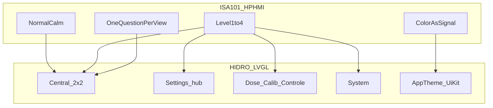

# Fundamentos HMI situacional — validación HIDRO

Documento de **filosofía + justificación**: por qué la HMI HIDRO (LVGL, JC3248W535) está organizada como está, alineada a industria (ISA-101 / High Performance HMI / ASM).

**No es un rediseño.** Guía operativa de pantallas: [`HMI_DESIGN.md`](HMI_DESIGN.md).  
**Mapa de navegación:** [`HMI_NAV_MAP.md`](HMI_NAV_MAP.md).  
**Agente display:** [`.cursor/skills/hidro-hmi-display/`](../.cursor/skills/hidro-hmi-display/SKILL.md).

---

## 1. Propósito

La UI existe para **conciencia situacional (SA)**, no para verse “tipo app” ni para exhibir datos sin contexto.

En **≤ 3 segundos** el operador debe responder:

1. ¿El proceso está OK?
2. ¿Qué parámetro está mal?
3. ¿Qué acción tomo?

Eso corresponde al ciclo industrial **detectar → diagnosticar → responder** (ASM / ISA-101). Si una pantalla no ayuda a una de esas tres preguntas, no pertenece a ese nivel de la jerarquía.

---

## 2. Marco teórico

| Fuente | Aporte que adoptamos |
|--------|----------------------|
| **ANSI/ISA-101.01-2015** | Ciclo de vida HMI; filosofía + style guide + toolkit; diseño centrado en el operador |
| **High Performance HMI** (Hollifield / ASM Consortium) | Estado normal visualmente calmado; color solo para anormal; jerarquía L1–L4; información sobre datos crudos |
| **Rockwell Process HMI Style Guide** | Color reservado a alarmas; fondo no saturado; awareness de estado; color no es el único canal |
| **Práctica ASM / Processing** | Capas de saliencia: orientación → normal → off-normal → crítico; evitar “operar por alarma” |

### Principios condensados

1. **SA en ≤ 3 s** — detection → diagnosis → response  
2. **Normal = calmado** — campo visual neutro; no pantalla saturada  
3. **Color = señal** — rojo/ámbar solo anormal; no decoración ni ON/OFF brillante  
4. **Jerarquía L1–L4** — progressive disclosure; no menú plano de todo  
5. **Una tarea por vista** — menos clutter = menos error  
6. **Filosofía + toolkit** — tokens centralizados (`AppTheme` / `UiKit` / `HmiSemantics`)  
7. **Codificación redundante** — borde + badge + texto; color no es el único diferenciador  

---

## 3. Principios operativos

| Principio | Regla práctica HIDRO | Anti-patrón |
|-----------|----------------------|-------------|
| Color = semántica | Solo estado / precaución / CTA | Hex ad-hoc por pantalla; glow; “verde = todo OK” en celdas |
| OK es neutro | `text` / `muted` / `gridLine` | Pintar proceso normal de verde saturado |
| Alarma destaca | `alarm` en **borde** + badge | Rojo en fondos, iconos decorativos, bombas “ON” en rojo |
| Warn ≠ alarm | `warn` = sistema (UART, reset); `alarm` = sensor fuera de banda | Mezclar enlace caído con BAJO/ALTO |
| Una pregunta por pantalla | Monitoring / menú / detalle / acción / sistema | Setup + telemetría + diagnóstico en la misma vista |
| Navegación predecible | ≡ → SETTINGS; siempre **Atras**; CTA primaria clara | Gestos ocultos; botones solo en esquinas sin patrón |
| Toolkit único | `AppTheme` + `UiKit` + `HmiSemantics` | Clonar estilos en cada `*Screen.cpp` |
| Targets táctiles | ≥ ~44 px (`TOUCH_MIN_H`) | Filas densas “mobile list” &lt; 36 px |

---

## 4. Jerarquía L1–L4 → HIDRO

| Nivel ISA-101 | Rol | Pantallas HIDRO | Pregunta dominante |
|---------------|-----|-----------------|--------------------|
| **L1 Overview** | Situación global del proceso | `Central` — epicentro 2×2 EC \| pH \| ORP \| DO; temp + armado en header | ¿El cultivo/proceso está OK? |
| **L2 Unit / área** | Elegir dominio de trabajo | SETTINGS: Controle · Atlas · Dosificación · Ajuste · System · Sensors | ¿Qué área toco? |
| **L3 Detail** | Una acción o un parámetro | Alvo, Auto, Reservorio, hub bomba, Accionamiento, Calib, WiFi Setup | ¿Qué valor o acción concreto? |
| **L4 Diagnostic** | Diagnóstico / identidad | System (FW, UART, uptime); Display readings | ¿Qué falla el sistema? |

**Progressive disclosure:** el wizard de 1ª vez (idioma → reservorio → TZ → WiFi 4/5 → dispositivo 5/5) y Setup viven **fuera del epicentro**. Tras `setup_done`, L1 es Monitoring; no se mezcla onboarding con SA operativa.

Detalle de rutas: [`HMI_NAV_MAP.md`](HMI_NAV_MAP.md).

---

## 5. Semántica de color

Código de verdad: [`include/theme/AppTheme.h`](../include/theme/AppTheme.h), `HmiSemantics`.

| Token | Hex | Uso permitido | No usar para |
|-------|-----|---------------|--------------|
| `bg` | `#000000` | Fondo estructural | “Modo dark fancy” con gradientes |
| `surface` / `surfaceAlt` | navy | Filas, nav, chrome | Cards decorativas con sombra |
| `text` | `#E8EEF2` | Valores y títulos en estado normal | Alarma |
| `muted` | `#6A858E` | Labels, hints | CTA primaria |
| `gridLine` | `#70A9BE` | Borde celda OK | Alarma |
| `accent` | `#2EC4B6` | CTA / foco de acción | Estado de sensor OK |
| `warn` | `#E8B84A` | Precaución **sistema** | BAJO/ALTO de proceso |
| `alarm` | `#E85D5D` | Parámetro fuera de banda | Decoración, “Stop” genérico si no es alarma |

### Adaptación dark (no contradicción)

High Performance HMI clásico recomienda **gris medio** en DCS de sala de control. HIDRO usa **negro + navy** en panel LVGL 3.5" (invernadero / luz variable).

El principio validado es el mismo: **fondo estructural no saturado** + **color solo semántico**. El negro real (`bgPlate` en `NavShell`) maximiza contraste de valores y hace que `alarm` / `warn` salten sin competir con un fondo “navideño”.

---

## 6. Organización ya validada

| Fundamento industria | Evidencia en HIDRO | Por qué optimiza |
|----------------------|--------------------|------------------|
| Overview L1 | Monitoring 2×2 + temp header | Una mirada: ¿OK? ¿cuál falla? |
| Color solo anormal | Borde rojo BAJO/ALTO; OK neutro | Alarma salta sobre campo calmado |
| Warn ≠ alarm | UART/sistema vs sensor | Dos canales cognitivos |
| Progressive disclosure | SETTINGS → hubs → detalle | Setup/wizard no contaminan L1 |
| Toolkit | `AppTheme` + `UiKit` + `HmiSemantics` | Consistencia = menos decisión ad-hoc |
| Targets táctiles | 44–48 px filas/botones | Panel industrial, dedo con guante |
| Una pregunta / vista | Skill: no mezclar Monitoring + setup + diag | Menos error bajo estrés |

### Gap consciente (futuro, no bloqueante)

HP-HMI recomienda **indicadores analógicos / trends embebidos** (valor vs banda normal). Hoy HIDRO prioriza **números grandes + borde/badge** en 480×320. Trends de proceso quedan como mejora opcional; no invalidan la jerarquía ni la semántica de color actuales.

---

## 7. Checklist de decisión (antes de tocar UI)

Responder en orden. Si falla un ítem, rediseñar el alcance de la pantalla.

1. **¿Qué nivel L1–L4 es?** Si no cabe, dividir pantallas.  
2. **¿Cuál es la única pregunta** que el operador responde aquí?  
3. **¿El estado normal queda neutro?** (sin verde/rojo decorativo)  
4. **¿Alarma/warn usan solo tokens** `alarm` / `warn` y canales correctos?  
5. **¿Reuso `UiKit` / `AppTheme` / `HmiSemantics`?** Sin hex nuevos en screens.  
6. **¿Navegación ≡ / Atras / CTA** predecible?  
7. **¿DoD Monitoring intacto** si tocaste display? ([`DISPLAY_BASELINE.md`](DISPLAY_BASELINE.md))  

Criterio rápido: *“¿Esta pantalla respeta ISA-101 situacional?”* → sí solo si pasa 1–6 (y 7 si aplica).

---

## 8. Referencias

### Industria

- [ISA-101 Series](https://www.isa.org/standards-and-publications/isa-standards/isa-101-standards) — Human Machine Interfaces for Process Automation  
- [High Performance HMI overview (ISA)](https://www.isa.org/getmedia/06130a38-f7af-4b35-8c9c-2c34f25c1977/The-High-Performance-HMI-Overview-v2-01.pdf) — Hollifield / ASM  
- [Rockwell Process HMI Style Guide (PROCES-WP023)](https://literature.rockwellautomation.com/idc/groups/literature/documents/wp/proces-wp023_-en-p.pdf)  
- [High Performance HMI principles (síntesis práctica)](https://plcprogramming.io/blog/high-performance-hmi-isa-101)  
- [Processing Magazine — operator awareness / ISA-101](https://www.processingmagazine.com/process-control-automation/article/55386069/bridging-the-gap-between-automation-and-operator-awareness-in-the-process-industries)  

### Internas

- [`HMI_DESIGN.md`](HMI_DESIGN.md) — paleta, wireframe epicentro, reglas de pantalla  
- [`HMI_NAV_MAP.md`](HMI_NAV_MAP.md) — árbol de navegación  
- [`HMI_OPERATOR_GUIDE.md`](HMI_OPERATOR_GUIDE.md) — flujo operador  
- [`DISPLAY_BASELINE.md`](DISPLAY_BASELINE.md) — DoD display  
- `include/theme/AppTheme.h`, `theme/UiKit.*`, `HmiSemantics.h`, `src/ui/NavShell.cpp`
