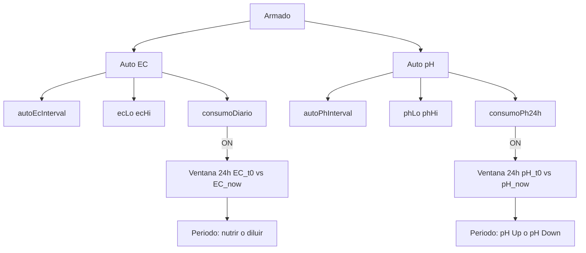

# Implementación real MasterLink ↔ ESP-HIDROWAVE

**Canónico Master ← Display** — checklist único de interoperabilidad / compatibilidad.  
**Fecha:** 2026-08-10  
**Audiencia:** quien porta el bridge UART y los lazos en el **Master real** (HIDROWAVE de producción).  
**HMI:** ya emite el contrato (`ESP-SENSORS-main`). **No tocar UI** para esta sync.  
**Importante:** la carpeta `ESP-HIDROWAVE/` embebida en este zip puede estar **desactualizada** — no es la verdad. Anexo JSON: [`HMI_UART.md`](HMI_UART.md). Mapa HMI / DoD cable: [`HANDOFF.md`](HANDOFF.md).

---

## Una frase

El Display manda JSON por UART; el Master debe aceptar las `action` de abajo, usar **siempre** banda Alvo como deadband (nunca `50` µS fijo), y opcionalmente capas **Consumo EC/pH 24h** independientes. Sin eso no hay interoperabilidad plena Auto.

---

## Índice

1. [Contrato mínimo de compatibilidad](#1-contrato-mínimo-de-compatibilidad)
2. [Tabla de actions UART](#2-tabla-de-actions-uart-display--master)
3. [loop_control — campos](#3-loop_control--campos)
4. [Deadband Alvo + Consumo 24h EC/pH](#4-deadband-alvo--consumo-24h-ecph)
5. [PARCIAL / HUECO — v1 vs diferible](#5-parcial--hueco--v1-vs-diferible)
6. [API / bridge sugerida](#6-api--bridge-sugerida)
7. [Checklist Master prod](#7-checklist-master-prod)
8. [Prueba sync](#8-prueba-sync)

---

## 1. Contrato mínimo de compatibilidad

| Capa | Obligatorio v1 (compat Auto EC) | Diferible |
|------|----------------------------------|-----------|
| UART RX + `cmd_ack` | Sí | — |
| `dose` / `dose_hold` / `dose_stop` | Sí | — |
| `nutrient_proportions` | Sí | — |
| `setpoint` EC | Sí | ORP/DO |
| `loop_control`: `volumeL`, armed, `autoEc`, intervalo, `ecLo/Hi`, `maxStepEc` | Sí | — |
| Quitar deadband 50 fijo | Sí | — |
| `consumoDiario` + ventana EC 24 h | Sí (si UI toggle existe) | — |
| `autoPh` runtime + `phLo/Hi` + `consumoPh24h` | Recomendado | Si no hay lazo pH aún: ack + NVS, documentar PARCIAL |
| `homoSec` / gaps / pulsos / mode / delay | — | Aplicar o ignorar con log |
| `calib` sensor | — | Stub ack OK hoy |
| `wifi_config` / `sys_info` / `slaves_*` / `relay_*` | Según producto Atlas/cloud | — |

**Fuentes HMI (solo lectura):** [`src/uart/MasterLink.cpp`](../src/uart/MasterLink.cpp) · [`HMI_UART.md`](HMI_UART.md).

---

## 2. Tabla de actions UART (Display → Master)

Líneas JSON + `\n`, baud **115200**. Tras cada cmd de proceso: `{"t":"cmd_ack","action":"...","ok":true,"commandId":N}`.

| `action` | Dirección | Master debe | Prioridad |
|----------|-----------|-------------|-----------|
| *(telemetry)* | Master → HMI | Emite `t:telemetry` (ph, ec, temp_agua; orp/do opc.) | v1 |
| `dose` | HMI → Master | Dosar canal `R1`…`R6` por `ml` | v1 |
| `dose_hold` | HMI → Master | Hold on/off canal | v1 |
| `dose_stop` | HMI → Master | Parar canal / cancelar secuencia | v1 |
| `nutrient_proportions` | HMI → Master | `updateNutrientProportions` | v1 |
| `setpoint` | HMI → Master | EC → lazo; pH → runtime o NVS | v1 EC / PARCIAL pH |
| `loop_control` | HMI → Master | Ver §3 | v1 (núcleo Auto) |
| `calib` | HMI → Master | Ack; UI HMI hoy bloqueada (módulo físico) | diferible |
| `wifi_config` | HMI → Master | SoftAP / WiFi + ack | cloud |
| `sys_info_req` | HMI → Master | Responde `t:sys_info` | cloud / System |
| `slaves_req` | HMI → Master | Responde `t:slaves` | Atlas |
| `relay_slave` | HMI → Master | ESP-NOW Atlas (MAC real; rechazar `atlas`/`local`) | Atlas |
| `relay_local` | HMI → Master | Relé local Master | Atlas / local |

Detalle JSON: [`HMI_UART.md`](HMI_UART.md).

---

## 3. loop_control — campos

```json
{"t":"cmd","action":"loop_control",
 "volumeL":50.0,
 "homoSec":60,"nutrientGapSec":3,"pulseMl":2.0,"pulseGapSec":2,"dosingDelaySec":60,
 "dosingMode":"batch",
 "dosingArmed":true,
 "autoEc":true,"autoEcIntervalSec":30,
 "autoPh":true,"autoPhIntervalSec":30,
 "maxStepEc":0.5,"maxStepPh":0.5,
 "dosingConstEc":0,"dosingConstPh":0,
 "phUpRelay":1,"phDownRelay":2,
 "consumoDiario":false,
 "consumoPh24h":false,
 "ecLo":300,"ecHi":800,
 "phLo":5.5,"phHi":6.5}
```

| Campo | Rol |
|-------|-----|
| `dosingArmed` | Gate global; sin esto HMI manda `autoEc`/`autoPh` en false |
| `autoEc` / `autoEcIntervalSec` | Lazo EC + periodo tick |
| `autoPh` / `autoPhIntervalSec` | Lazo pH + periodo (si existe runtime) |
| `volumeL` | Volumen → ECController |
| `ecLo`/`ecHi` | Deadband Auto EC (**sustituye 50**) |
| `phLo`/`phHi` | Deadband Auto pH |
| `consumoDiario` | Capa Consumo **EC** 24 h |
| `consumoPh24h` | Capa Consumo **pH** 24 h |
| `maxStepEc`/`maxStepPh` | α / agresividad 0…1 |
| `phUpRelay`/`phDownRelay` | Bombas 1…6; 0 = sin asignar |
| `homoSec`, gaps, pulsos, `dosingMode`, delay | Malha física — PARCIAL si se ignoran |
| `dosingConst*` | HMI envía 0 |

**Emisión HMI:** sync Auto/Reservorio; Guardar Alvo **EC o pH** reenvía bandas.

---

## 4. Deadband Alvo + Consumo 24h EC/pH



### A. Deadband (siempre)

```
toleranceEc = (ecHi > ecLo) ? max(1, (ecHi-ecLo)/2) : INVALID → no dose
tolerancePh = (phHi > phLo) ? max(0.01, (phHi-phLo)/2) : INVALID → no dose
```

Nunca hardcode `50.0` como diseño.

### B. Consumo EC OFF

P reactivo + `toleranceEc`. Sin ventana 24 h.

### C. Consumo EC ON (`consumoDiario`)

- Misma `toleranceEc`; **no** cambiar `autoEcInterval`.
- Flanco OFF→ON: `ec_t0 = ec`, reiniciar ventana.
- A 24 h: `deltaEc = ec_t0 - ec_now`.
  - EC bajó (delta positivo grande) → hambre → nutrientes de periodo.
  - EC subió (delta negativo material) → validar **dilución**.
- Tick Auto sigue con banda durante la ventana.
- Fail-safe ml/día. ON→OFF: limpia ventana; banda Alvo sigue.

### D. Consumo pH OFF

Auto pH tick + `tolerancePh` (si hay lazo pH).

### E. Consumo pH ON (`consumoPh24h`)

- Independiente de EC; **no** cambiar `autoPhInterval`.
- Flanco OFF→ON: `ph_t0 = pH`.
- A 24 h: `deltaPh = ph_now - ph_t0`.
  - pH subió → pH Down; pH bajó → pH Up.
- Fail-safe ácido/base por ventana.

### F. Gate

Sin `autoEc` / `autoPh` efectivo: no dosificar ese lazo.

---

## 5. PARCIAL / HUECO — v1 vs diferible

| Ítem | Estado tipico bridge zip | Qué hacer en prod |
|------|--------------------------|-------------------|
| Auto EC + banda + consumo EC + maxStepEc + volume | Núcleo | **Obligatorio v1** |
| Auto pH runtime | Solo NVS | Implementar lazo o declarar PARCIAL documentado |
| `phLo/Hi`, `consumoPh24h` | HMI ya envía | Parse + ventana si hay lazo pH |
| homo / gaps / pulsos / mode / delay | A menudo ignorados | Aplicar o log “ignored” |
| `calib` sensor | Ack stub | Diferible; HMI usa módulo físico |
| Setpoint ORP/DO | Ausente | HUECO producto |
| Atlas `relay_slave` / `slaves` | OK con MAC real | Mantener rechazo placeholder |

No cruzar lazos EC↔pH. No inventar deadband distinto de Alvo.

---

## 6. API / bridge sugerida

| API | Uso |
|-----|-----|
| `setEcDeadbandLimits` / `setPhDeadbandLimits` | Desde UART |
| `setConsumoDiarioEnabled` / `setConsumoPh24hEnabled` | Flags; reinicio ventana en flanco |
| `setMaxStepEcFraction` / `setMaxStepPhFraction` | α periodo |
| `setAutoECEnabled` / intervalo / volume | Ya existentes |
| `tickConsumoEcWindow` / `tickConsumoPhWindow` | En loop Auto |
| Bridge `handleLoopControl` | Parse §3 + NVS opcional + `cmd_ack` |

---

## 7. Checklist Master prod

### Compatibilidad base
1. [ ] Baud 115200; RX/TX cruzados con HMI (17/18); `cmd_ack` en cmds de proceso.
2. [ ] `dose` / `dose_hold` / `dose_stop` / `nutrient_proportions`.
3. [ ] `setpoint` EC → lazo; telemetría periódica.

### loop_control + Auto EC
4. [ ] Handler `loop_control` completo (parse §3).
5. [ ] Eliminar deadband 50 fijo.
6. [ ] Tolerancia = half-band `ecLo`/`ecHi`; inválida → no dose.
7. [ ] `consumoDiario`: ventana 24 h EC (nutrir/diluir); intervalos intactos.
8. [ ] Fail-safe ml/día.

### Auto pH / Consumo pH (si v1 incluye pH)
9. [ ] Runtime Auto pH + `phLo`/`phHi` + relés Up/Down.
10. [ ] `consumoPh24h`: ventana 24 h independiente.
11. [ ] Lazos no se cruzan.

### Atlas / cloud (según producto)
12. [ ] `slaves_req` / `relay_slave` / `relay_local` / `wifi_config` / `sys_info_req`.

---

## 8. Prueba sync

| Paso | Esperado |
|------|----------|
| Alvo EC 1500–1700 | Deadband EC 100 |
| Alvo pH 5.5–6.5 | Deadband pH 0.5 |
| Consumo EC ON | Ventana EC 24 h; nutrir/diluir al cierre |
| Consumo pH ON | Ventana pH 24 h; Up/Down al cierre |
| Un toggle OFF | El otro sigue independiente |
| Dose R1 Armado INACTIVO | Bomba + `cmd_ack` |
| Armado ACTIVO | Manual bloqueado en HMI |

Cable / DoD flasheo: [`HANDOFF.md`](HANDOFF.md).

---

## Referencias HMI (solo lectura)

| Qué | Path |
|-----|------|
| Emisor UART | `src/uart/MasterLink.cpp` |
| Toggles NVS | `ReservoirConfig`, `ControleAutoScreen` |
| Bandas Alvo | `DataStore` Ec/Ph; `ParamDetailScreen` → `loop_control` |
| Contrato JSON | `docs/HMI_UART.md` |
| Matriz estado HMI | `docs/HANDOFF.md` |

---

## Fuera de alcance de este canónico

- Telemetría HMI de ΔEC/ΔpH en pantalla.
- Day/Night setpoint / PID completo.
- Reescribir UI display.
- Docs internos Master no-UART (`ESP-HIDROWAVE/*IMPLEMENTACAO*` mutex/event-bus/DNS).
